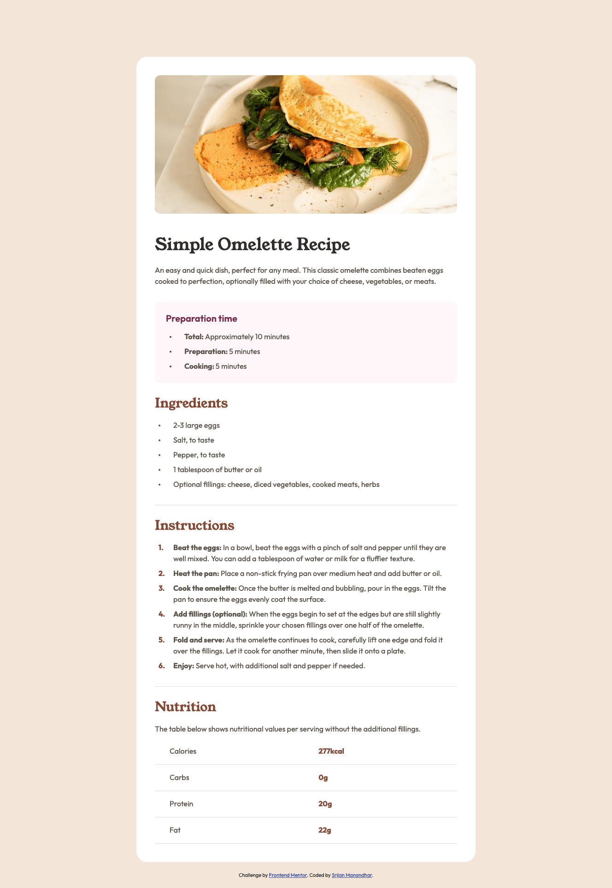

# Frontend Mentor - Recipe page solution

This is a solution to the [Recipe page challenge on Frontend Mentor](https://www.frontendmentor.io/challenges/recipe-page-KiTsR8QQKm). Frontend Mentor challenges help you improve your coding skills by building realistic projects.

## Table of contents

- [Overview](#overview)
  - [Screenshot](#screenshot)
  - [Links](#links)
- [My process](#my-process)
  - [Built with](#built-with)
  - [What I learned](#what-i-learned)
  - [Useful resources](#useful-resources)
- [Author](#author)

## Overview

### Screenshot



### Links

- Solution URL: [https://github.com/srijanss/recipe-page](https://github.com/srijanss/recipe-page)
- Live Site URL: [https://srijanss.github.io/recipe-page/](https://srijanss.github.io/recipe-page/)

## My process

### Built with

- Semantic HTML5 markup
- CSS custom properties
- Flexbox
- Mobile-first workflow

### What I learned

```css
body {
  font-family: var(--primary-font);
  font-weight: var(--font-weight-regular);
  font-size: var(--default-font-size);
  line-height: 1.5rem;
  color: var(--black);
  background-color: var(--egg-shell);
  counter-reset: ordered-list-item;
}
ul li::before {
  content: "";
  position: absolute;
  top: calc(50% - 2px);
  left: 0.5rem;
  width: 4px;
  height: 4px;
  border-radius: 50%;
  background-color: var(--dark-raspberry);
}
ol li::before {
  counter-increment: ordered-list-item;
  content: counter(ordered-list-item) ".";
  position: absolute;
  top: 0;
  left: 0.5rem;
  color: var(--nutmeg);
  font-weight: var(--font-weight-bold);
}
```

- In this challenge, I learned about CSS pseudo selectors like ::before, ::after, ::marker.
- Also got to learn about the CSS counters and how to use them with ordered list element.

### Useful resources

- [https://developer.mozilla.org/en-US/docs/Web/HTML/Element](https://developer.mozilla.org/en-US/docs/Web/HTML/Element) - This helped me for writing semantic HTML. I really liked the information in this site and will use it as reference going forward.
- [https://developer.mozilla.org/en-US/docs/Web/CSS/CSS_counter_styles/Using_CSS_counters](https://developer.mozilla.org/en-US/docs/Web/CSS/CSS_counter_styles/Using_CSS_counters) - This is an amazing article which helped me understand CSS counters. I'd recommend it to anyone still learning this concept.

## Author

- Website - [Srijan Manandhar](https://github.com/srijanss)
- Frontend Mentor - [@srijanss](https://www.frontendmentor.io/profile/srijanss)
